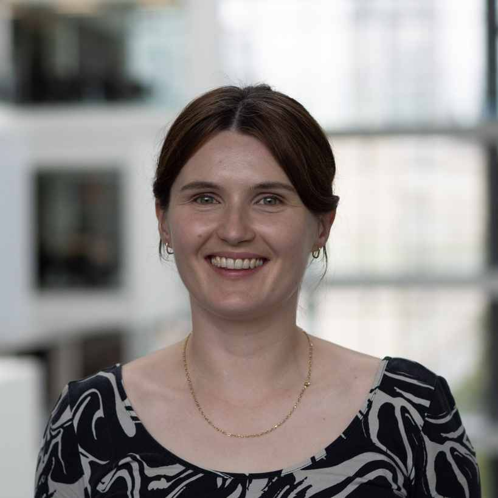
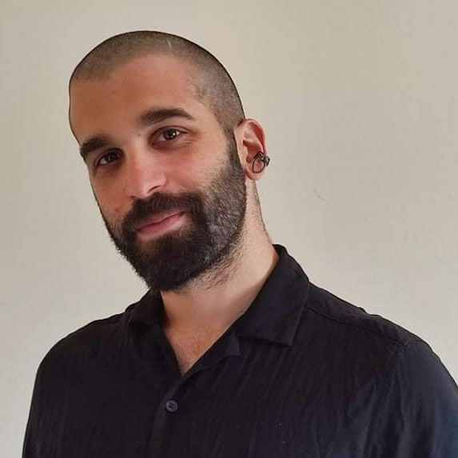
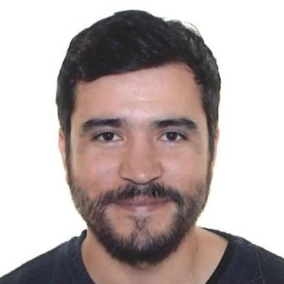
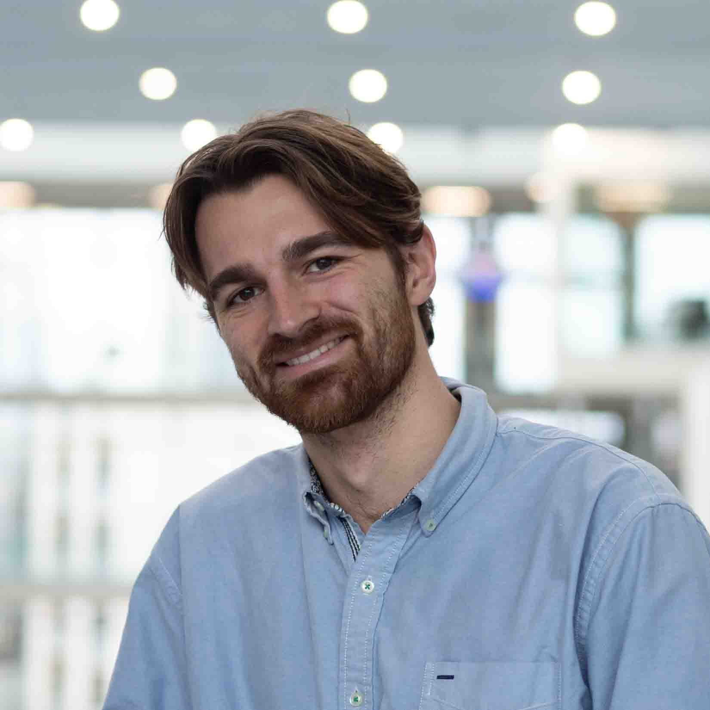
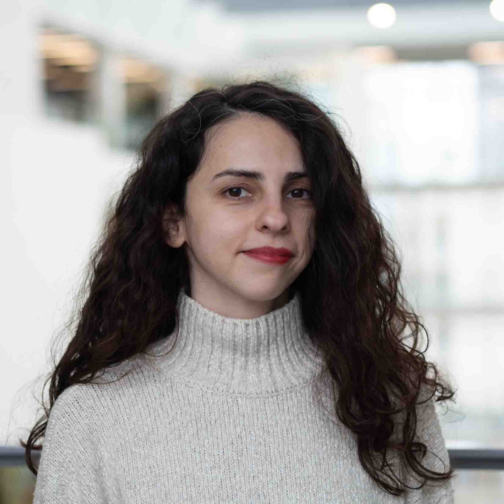
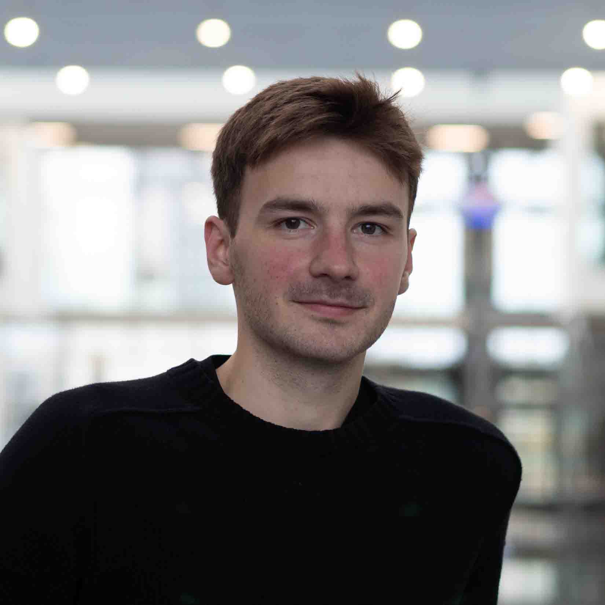
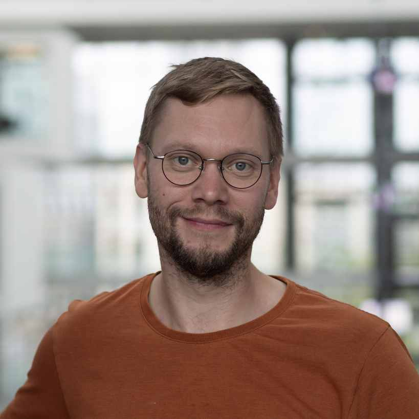
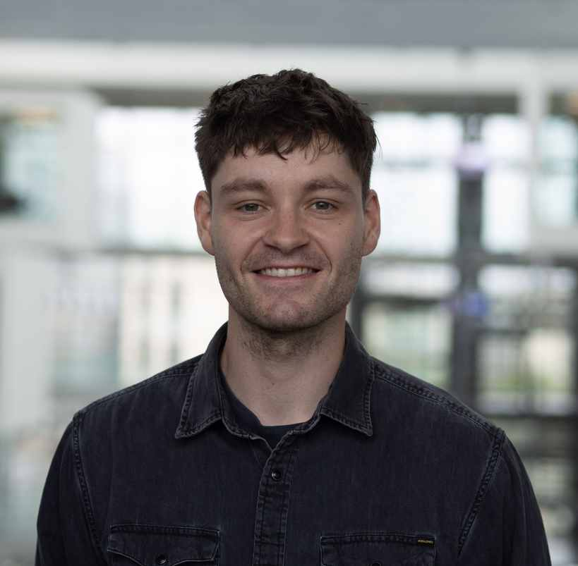
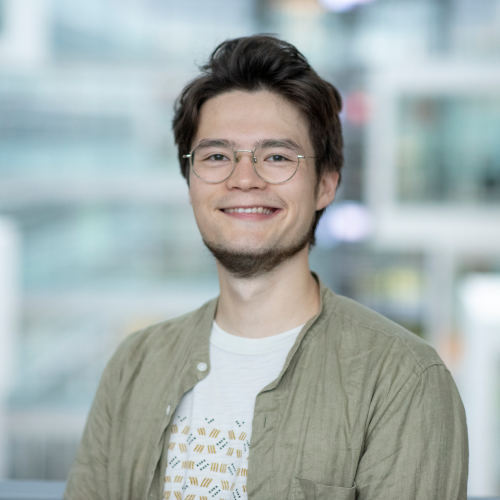



## Explainable and transparent NLP

The NLP systems based on large language models are increasingly deployed in many real-world applications, and have real impact on the lives on many people. However, we still do not have reliable methods to explain the 'reasoning' backing their outputs, and many current systems also lack even the minimal transparency about their design and training data. 

My current work in this area is backed by 2024 Villum Young Investigator grant (see [upcoming positions](#phd-and-postdoc-positions)). It focuses on the problem of attribution of the output of generative language models to their training data. This project has planned collaborations with :us: [Allen Institute for AI](https://allenai.org/), :us: [Carnegie Mellon University](https://www.cmu.edu/), :us: :fr: [HuggingFace](https://huggingface.co/), and :jp: [RIKEN-CSS](https://www.r-ccs.riken.jp/en/).

Some relevant past work: 




{{ interpretability| markdownify }}



## Safe and Robust NLP

I use "safety" in the engineering sense of the word: the NLP systems should actually do what their developers are promising, the same way as e.g. construction engineers ensure that the bridges they build withstand the target load. This is bordering on the problem of robustness or generalization: the NLP systems are trained on some data, and to perform in the real world they need to generalize to the real-world data.

My current work in this area is backed by 2023 DFF Inge Lehmann grant (see [upcoming positions](#phd-and-postdoc-positions)). It focuses on the development of a benchmark that would reward systems for generalizing rather than memorizing their training data. This project has a planned collaboration with :us: [New York University](https://allenai.org/). I also host an industrial PhD student co-funded by Innovation Fund Denmark, whose work focuses on robust assistance with clinical note entry.

Some relevant past work: 




{{ robustness| markdownify }}



## Sustainable NLP

The current cutting-edge NLP systems are based on large language models, some with hundreds with billions of parameters. As they are increasingly embedded in everyday applications and used of millions of people, the carbon costs of their use are also skyrocketing. It is imperative that in the future we find more efficient methods to achieve the same or better levels of performance.

My current work in this area is backed by 2023 DFF Inge Lehmann grant (see [upcoming positions](#phd-and-postdoc-positions)). It focuses on the development of a benchmark suite that deliberately caps pre-training and test data, so as to encourage machine learning research on more efficient solutions. This project has a planned collaboration with :us: [New York University](https://allenai.org/).

Some relevant past work: 




{{ efficiency| markdownify }}

# Lab





[Amelie Wührl](https://scholar.google.com/citations?user=jwkTGVYAAAAJ&hl=en&oi=ao)  
*data attribution, fact-checking*

postdoc 



{{ amelie | markdownify }}



[Nikolas Vitsakis](https://scholar.google.com/citations?user=K97CGdYAAAAJ&hl=en&oi=ao)  
*NLP for Social Science Research, AI ethics*

postdoc 



{{ nikolas | markdownify }}



[Arturo Valdivia](https://scholar.google.com/citations?user=tEMOke8AAAAJ&hl=en&oi=ao)  
*User modeling, NLP for Social Good*

postdoc (joint affiliation with [CAISA](https://caisa.dk))



{{ arturo | markdownify }}







[Andreas Geert Motzfeldt](https://scholar.google.com/citations?user=exKjb8YAAAAJ&hl=en&oi=ao) 
*interpretability, robustness in clinical NLP*

PhD student co-supervised with [Christian Hardmeier](https://christianhardmeier.rax.ch/)
{: .cosupervisor }



{{ andreas | markdownify }}



Arzu Burcu Güven 
*robustness, generalization across linguistic features* 

PhD student co-supervised with [Rob van der Goot](https://robvanderg.github.io/)
{: .cosupervisor }



{{ arzu | markdownify }}



[Bertram Højer](https://bertramhojer.github.io/) 
*interpretability, model analysis* 

PhD student co-supervised with [Stefan Heinrich](https://stefanheinrich.net/) 
{: .cosupervisor }



{{ bertram | markdownify }}







[Mattes Ruckdeschel](https://scholar.google.com/citations?user=9nRUy1AAAAAJ&hl=en&oi=ao) 
*data attribution, argumentation analysis* 

PhD student co-supervised with [Toine Bogers](http://toinebogers.com/) 
{: .cosupervisor }



{{ mattes | markdownify }}



Johannes Gabriel Sindlinger 
*data attribution, interpretability* 

PhD student 
PhD student co-supervised with [Leon Derczynski](https://www.derczynski.com/itu/) 
{: .cosupervisor }



{{ johannes | markdownify }}



{{ postdocs | markdownify }}

{{ students | markdownify }}

{{ students2 | markdownify }}

The lab is part of [NLPNorth research group](https://nlpnorth.github.io/), with 4 other full-time faculty working in NLP. We are also a part of the [AI Pioneer center](https://www.aicentre.dk/people), where it is possible to interact with other NLP researchers in University of Copenhagen and other institutions. Here are some [reflections by NLPNorth PhD students](https://nlpnorth.github.io/content/phd-reflections.html) on what it's like to live and study in Denmark.

# Alumni



[Max Müller-Eberstein](https://mxij.me/)  
*generalization, data efficiency*

postdoc, currently postdoc at the [University of Tokyo](https://phiz.c.u-tokyo.ac.jp/~oseki/en/members.html) 



{{ max | markdownify }}

# PhD and Postdoc Positions



**Upcoming funded position:** 

 - PhD position in a EU-funded project on paper-reviewer matching for conference peer review. Apply for position DC6 [here](https://www.cords-dn.at/how-to-apply/) by Jan 6. Interdisciplinary project in NLP + discrete optimization, co-supervised by experts in the latter ([Kevin Tierney at the University of Vienna](https://www.univie.ac.at/en/news/new-professorships/details/tierney-kevin) and [Rune Møller Jensen (ITU)](https://pure.itu.dk/da/persons/rune-m%C3%B8ller-jensen/)). The goal is to develop interpretable and more accurate paper-reviewer matching methods based on analysis of abstracts of the submissions and candidate reviewers' past work, as well as various constraints of the matching process such as fairness and balance of different perspectives. 
 - Interdisciplinary postdoc position on real-world evaluation of AI systems, hosted at Aalborg University and led by [Roman Jurowetzki](https://rjuro.com/), co-advised by me. See [here](https://caisa-postdoc-interest.rjuro.com/) for details.  

In your research statement, please focus on the kinds of questions you might want to pursue, given the focus of the project, and why you have the ability or experience to contribute to answering such questions. Brevity is appreciated, references are welcome. The earliest possible starting date is March 1, but later dates can be accomodated. Please include your preferred starting date in the cover letter.

I do *not* currently have the possibility to host interns. I maintain a list of [upcoming talks and events](https://annargrs.github.io/talks/#upcoming-talks), where it might be possible to meet in person. 



{{ notice-1 | markdownify }}

**Getting your own funding** (if you have your own idea for a PhD or postdoc that you'd like to pursue with me):
  - DARA and DDSA funding opportunities (have a look at prior/current calls for [PhD](https://www.daracademy.dk/fellowship/fellowships-summer-2025) and [postdoc](https://ddsa.dk/postdocfellowshipprogramme/) applications)
  - [Marie Curie postodcs](https://marie-sklodowska-curie-actions.ec.europa.eu/actions/postdoctoral-fellowships): next application round is in the fall 2026. For EU-based applicants it is possible to obtain funding for a short visit to ITU for developing the application in spring 2026.

If you'd like me to support your funding application, please get in touch and let me know **what are the specific research interests we have in common** (based on the above lab research directions or my past work).  

<!-- **Winning your own grant:** if you have your own idea for a PhD or postdoc position that you'd like to pursue with me, have a look at the current DDSA funding opportunities ([PhD](https://ddsa.dk/phdfellowshipprogramme/), [postdoc](https://ddsa.dk/postdocfellowshipprogramme/)) and reach out. I can also host [Marie Curie postodcs](https://marie-sklodowska-curie-actions.ec.europa.eu/actions/postdoctoral-fellowships). -->


**Logistics:** 
- Generally, to be enrolled in the Ph.D. school in Denmark, you need to have a 2-year Master's degree. The only possible exception at ITU is candidates who have 180 ECTS points from their B.Sc. program plus at least 60 ECTS points of master's level studies (a total of 240 ECTS points). Such candidates would need to start by spending a year to finish their Master's degree, and they would receive a significantly lower salary for two years, so unfortunately this is not a very good deal. 
- The PhD in Denmark is fixed-term (3 years). It is possible to take breaks to go on internships.
- Non-EU candidates will need to receive a visa before the start of the studies, which usually takes about 3 months (after you receive and accept the offer).
- You *don't* have to learn Danish, either for professional or everyday life.


{{ notice-2 | markdownify }}

# Thesis and project supervision at ITU



If you're a B.Sc. or M.Sc. student at IT University of Copenhagen, and you would like to work with me, please: 

- reach out stating `[ITU M.Sc. thesis]`, `[ITU B.Sc. thesis]` or `[ITU research project]` at the start of the subject.
- introduce yourself and state:
  - the topic(s) that could be in our shared interests (see mine below) 
  - your background and any **relevant experience**. For an NLP project, you would ideally have taken an NLP course (even online or self-taught), or you have hands-on experience with the subject matter relevant to your preferred topic.

Here are some of the research directions that I would be interested in: 

- **Language model analysis**: identifying the types of knowledge acquired from language model pre-training.  
- **Language processing strategies**: do NLP models perform well for the right reasons? What strategies should they follow when solving reasoning tasks?
- **Robustness and generalization**: do NLP models reliably perform their tasks out of training distribution, and what can we do to help them?
- **NLP system auditing and documentation**: establishing the cases where a system is safe to deploy
- **NLP system interpretability**: how can we establish how a deep learning model arrives at its decisions?
- **Sustainable NLP**: how can we build systems that work well, but don't require billions of parameters and terabytes of data? 

Feel free to also look at my recent [publications](/publications) and see if there's anything you'd like to build on.



{{ itu | markdownify }}
